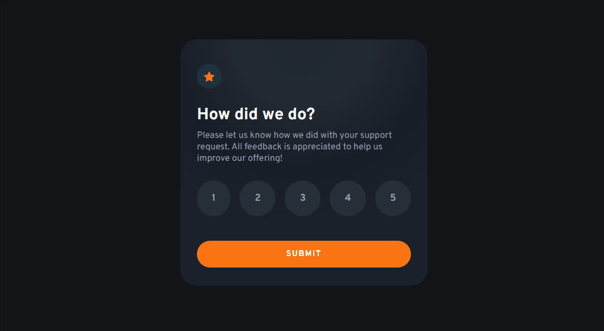

# Componente de Avaliação Interativa Principal
Um projeto que permite selecionar uma nota. Ao enviar aparecerá uma imagem, com um agradecimento e a nota que foi selecionada. 🎉

[]

## Tecnologias utilizadas:
- HTML
- CSS
- JS